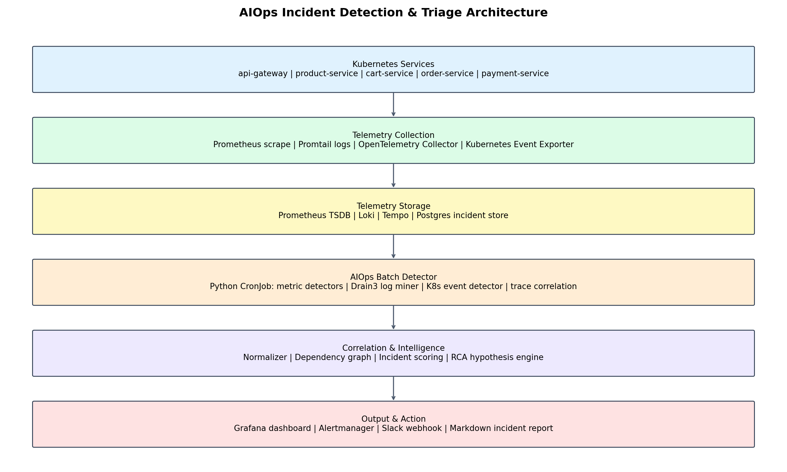
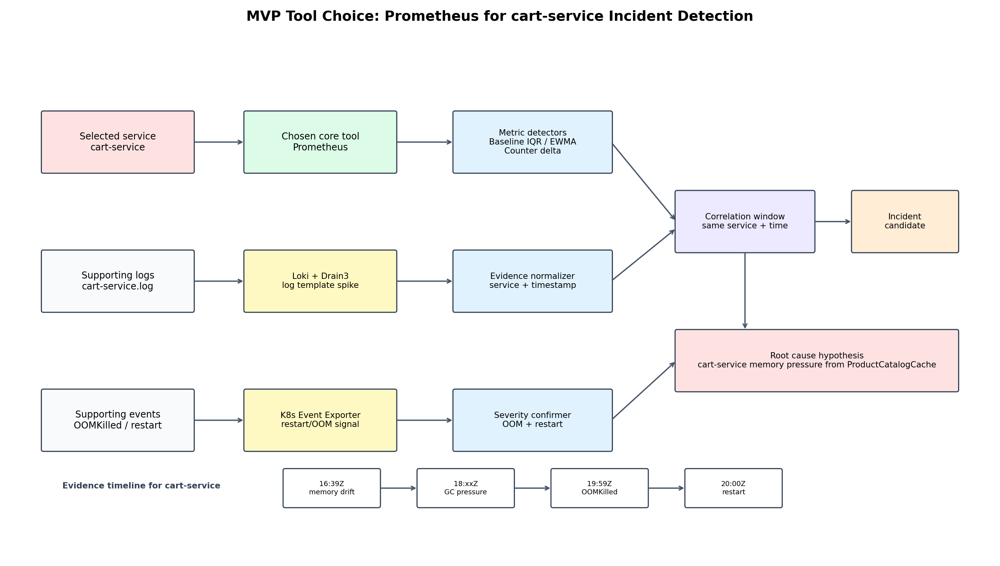
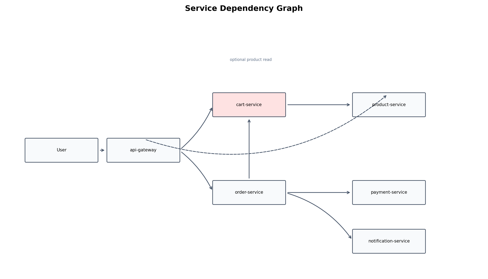
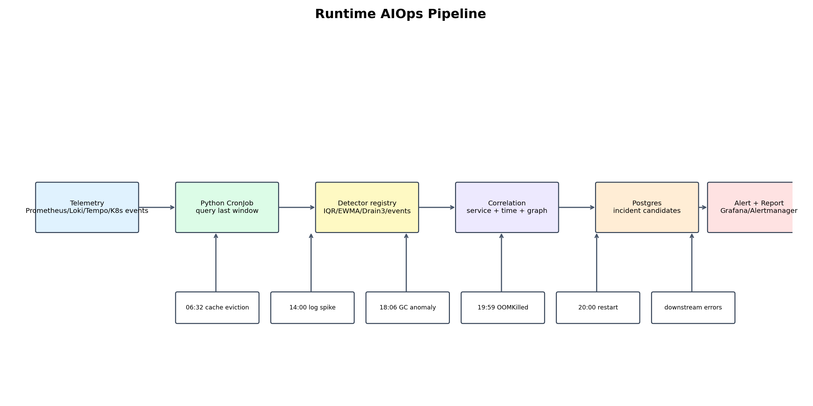

# AIOps Architecture Proposal

## Mục tiêu

Thiết kế này biến bài phân tích incident hiện tại thành một pipeline AIOps tự động. Notebook vẫn dùng để giải thích và kiểm chứng, nhưng kiến trúc production cần tự động:

1. Thu thập telemetry.
2. Detect anomaly.
3. Gom signals theo service, thời gian và dependency graph.
4. Tạo incident candidate.
5. Sinh root cause hypothesis.
6. Gửi alert/report kèm evidence.

## Architecture Overview



## MVP Tool Choice: Prometheus cho cart-service

Trong phần defend, nên chọn một hướng MVP cụ thể thay vì trình bày quá nhiều tool ngang nhau.

**Tool chính được chọn:** `Prometheus`

**Service dùng để defend:** `cart-service`



Lý do chọn `Prometheus` làm tool chính:

- Incident hiện tại có tín hiệu định lượng rất rõ trên metrics: memory tăng, GC pause tăng, latency tăng, restart count tăng.
- Prometheus phù hợp với Kubernetes và có thể scrape metrics mỗi 30 giây, giống sampling interval của dataset.
- PromQL đủ để query các window gần nhất, ví dụ 5 phút, 30 phút, 2 giờ.
- Chi phí vận hành thấp hơn so với dựng full streaming pipeline bằng Kafka/Redpanda ngay từ đầu.
- Phù hợp để tự động trả lời `WHEN` và `WHERE`.

Trong MVP này, `Prometheus` là core detection tool. Các tool khác chỉ là evidence bổ trợ:

| Tool | Vai trò trong MVP |
|---|---|
| Prometheus | Detect anomaly chính cho `cart-service` metrics |
| Loki + Drain3 | Giải thích log pattern nào spike sau khi Prometheus khoanh vùng |
| Kubernetes Event Exporter | Xác nhận OOMKilled/restart là event hạ tầng thật |
| Postgres | Lưu anomaly signal, incident candidate, evidence timeline |
| Grafana/Alertmanager | Hiển thị dashboard và gửi alert |

Luồng defend cho `cart-service`:

```text
Prometheus scrape cart-service metrics
→ metric detector phát hiện memory/GC/latency bất thường
→ correlation engine chọn cart-service là incident candidate
→ Loki/Drain3 kiểm tra log quanh timestamp đó
→ Kubernetes Event Exporter xác nhận OOMKilled/restart
→ tạo root cause hypothesis: ProductCatalogCache gây memory pressure/OOM
```

Điểm cần nói rõ khi defend:

```text
Prometheus không tự chứng minh root cause một mình.
Prometheus giúp tự động phát hiện WHEN/WHERE.
Root cause cần log/event/trace để giải thích WHAT/WHY.
Vì vậy MVP chọn Prometheus làm detector chính, nhưng vẫn giữ Loki và K8s events làm evidence layer.
```

Luồng tổng quan:

```text
Kubernetes services
→ telemetry collection
→ telemetry storage
→ detection layer
→ correlation & intelligence
→ output & action
```

## Service Dependency Graph



Dependency graph giúp phân biệt:

- `root failure`: service có lỗi nội bộ xảy ra trước.
- `downstream symptom`: service bị lỗi do phụ thuộc vào service khác.

Trong incident hiện tại:

```text
cart-service OOM/restart trước
→ api-gateway lỗi khi gọi cart
→ order-service timeout khi gọi cart
→ payment-service bị ảnh hưởng sau
```

Vì vậy `api-gateway`, `order-service`, `payment-service` là downstream impact. Root failure đã chứng minh được nằm ở `cart-service`.

## Runtime Pipeline



Pipeline runtime:

1. Service phát sinh metrics, logs, traces, Kubernetes events.
2. Prometheus thu metrics.
3. Promtail đẩy logs vào Loki.
4. OpenTelemetry Collector đẩy traces vào Tempo.
5. Kubernetes Event Exporter thu OOMKilled/restart/CrashLoop events.
6. Các detector tạo anomaly signals.
7. Signals được publish vào `aiops.signals`.
8. Correlation engine gom signals theo service/time/dependency.
9. Incident scoring engine tính severity/confidence.
10. Root cause hypothesis engine sinh kết luận.
11. Alert/report được gửi qua Grafana, Alertmanager và Slack webhook.

## Tool Choices

### Prometheus

Chọn Prometheus vì:

- Phổ biến nhất cho Kubernetes metrics.
- Tích hợp tốt với Grafana và Alertmanager.
- Hỗ trợ PromQL để tính error rate, latency, restart delta, memory pressure.
- Phù hợp với scrape interval 30 giây như dataset hiện tại.

Vai trò:

```text
Prometheus → Metric anomaly detector
```

### Promtail + Loki

Chọn Promtail + Loki, không chọn Elasticsearch cho kiến trúc chính.

- Tích hợp tốt với Grafana.
- Chi phí thấp hơn Elasticsearch trong use case query theo service/pod/time.
- Phù hợp cho log spike detection và Drain3 template mining.

Vai trò:

```text
Promtail → Loki → Drain3 log template miner → Log spike detector
```

### Drain3

Drain3 gom raw logs thành template.

Ví dụ:

```text
Cart service timeout after 2406ms
Cart service timeout after 596ms
```

được gom thành:

```text
Cart service timeout after <*>
```

Lý do chọn:

- Giảm nhiễu từ ID, duration, userId.
- Dễ detect spike theo template.
- Giải thích được log pattern nào tăng bất thường.

### Kubernetes Event Exporter

Kubernetes events cung cấp evidence trực tiếp:

- OOMKilled
- CrashLoopBackOff
- restart count tăng
- memory limit exceeded

Trong incident hiện tại, OOMKilled là bằng chứng rất mạnh nên không nên chỉ dựa vào app logs.

Vai trò:

```text
Kubernetes Event Exporter → OOM/restart detector
```

### OpenTelemetry Collector + Tempo

Chọn OpenTelemetry Collector + Tempo, không chọn Jaeger cho kiến trúc chính.

Trace dùng để chứng minh quan hệ giữa service.

Trong dataset hiện tại, `product-service` có anomaly sớm nhưng chưa đủ bằng chứng để kết luận nó gây lỗi cart. Nếu có trace, có thể kiểm tra:

```text
cart-service có gọi product-service chậm/lỗi không?
product-service degradation có đi trước cart cache issue không?
request lỗi lan qua dependency path nào?
```

Vai trò:

```text
OpenTelemetry / Tempo → Dependency graph → Trace correlation
```

### Python AIOps CronJob + Postgres

Chọn Python AIOps CronJob thay vì Kafka/Redpanda cho kiến trúc chính.

CronJob chạy mỗi 5 phút:

```text
query Prometheus/Loki/Tempo/Kubernetes events
→ chạy detectors
→ correlate signals
→ ghi incident candidates vào Postgres
→ gửi alert qua Alertmanager/Slack
```

Lý do chọn:

- Chi phí thấp hơn streaming pipeline.
- Ít component hơn, dễ triển khai cho MVP.
- Phù hợp với bài toán detect incident theo window 5 phút.
- Vẫn đủ để chứng minh AIOps pipeline tự động, không phải notebook thủ công.

Postgres được chọn để lưu:

- anomaly signals
- incident candidates
- evidence timeline
- incident score/confidence

## Detection Strategy

### Metric Detector

Input:

```text
Prometheus metrics
```

Metric detector dùng detector registry. Mỗi metric được map tới detector phù hợp với hành vi của nó:

| Metric type | Example metrics | Detector |
|---|---|---|
| Resource | `cpu_usage_percent`, `memory_pct`, `jvm_gc_pause_ms_avg` | Baseline IQR, EWMA |
| Availability | `http_5xx_rate`, `upstream_timeout_rate`, `cart_upstream_error_rate` | Baseline IQR, Rolling IQR |
| Latency | `http_p99_latency_ms` | Baseline IQR, EWMA, Rolling IQR |
| Traffic | `http_requests_per_sec`, `active_connections` | Rolling IQR |
| Counter | `container_restart_count` | Counter delta |

Threshold rules are not the primary anomaly detector. They are used as operational severity confirmation, for example whether an anomaly violates a known SLO or operational limit.

Ví dụ signals:

```text
memory drift above baseline IQR
latency above EWMA baseline
5xx rolling IQR spike
restart_delta > 0
```

### Log Detector

Input:

```text
Loki logs
```

Pipeline:

```text
raw logs
→ Drain3 template mining
→ count template by time window
→ spike detection
```

Ví dụ signals:

```text
ProductCatalogCache eviction failed
OutOfMemoryError imminent
Container OOMKilled
Cart service timeout
```

### K8s Event Detector

Input:

```text
Kubernetes events
```

Detect:

```text
OOMKilled
CrashLoopBackOff
Restart count increased
```

### Trace Detector

Input:

```text
OpenTelemetry traces
```

Detect:

```text
slow dependency calls
high error spans
broken upstream/downstream paths
```

## Incident Scoring

Example scoring:

| Signal | Score |
|---|---:|
| OOMKilled | +50 |
| Restart loop | +40 |
| Memory pressure sustained | +25 |
| GC pause anomaly | +20 |
| Cache eviction log spike | +25 |
| 5xx rate sustained | +20 |
| Downstream timeout | +15 |
| Trace dependency error | +20 |

Threshold:

```text
score >= 80  → incident candidate
score >= 120 → critical incident
```

## Applied To Current Incident

Expected pipeline result:

```json
{
  "incident_id": "INC-20260601-cart-memory-pressure",
  "severity": "critical",
  "primary_service": "cart-service",
  "suspected_root_failure": "ProductCatalogCache memory pressure and eviction failure",
  "possible_upstream_trigger": "product-service degradation",
  "downstream_impact": [
    "api-gateway",
    "order-service",
    "payment-service"
  ],
  "confidence": {
    "cart_service_root_failure": "high",
    "product_service_trigger": "medium-low"
  }
}
```

## Cost Optimization

### Chosen Cost-Optimized Stack

Stack được chọn:

```text
Prometheus
Promtail + Loki
OpenTelemetry Collector + Tempo
Kubernetes Event Exporter
Python AIOps CronJob
Postgres
Grafana + Alertmanager + Slack webhook
```

Ưu điểm:

- Ít component.
- Dễ triển khai.
- Đủ cho bài toán detect metrics/logs/OOM/restart.
- Không cần Kafka/Redpanda ở giai đoạn đầu.

### Tools Not Selected For MVP

Không chọn cho MVP:

```text
Kafka/Redpanda
Elasticsearch
Thanos/Mimir
Jaeger
```

Lý do:

- Kafka/Redpanda làm tăng chi phí và độ phức tạp, trong khi batch 5 phút đủ cho lab/MVP.
- Elasticsearch tốn tài nguyên hơn Loki cho use case query theo service/pod/time.
- Thanos/Mimir chưa cần nếu retention metrics ngắn hạn đủ.
- Jaeger không được chọn để đồng bộ với Grafana Tempo stack.

### Retention Policy

| Data | Hot retention | Long-term |
|---|---:|---:|
| Metrics raw 30s | 7-15 days | Downsample 5m/1h |
| Logs | 7 days | Archive object storage |
| Traces | 1-3 days | Keep slow/error traces longer |
| Incident signals | 30-90 days | Postgres/object storage |

### Trace Sampling

Trace rất tốn storage, nên dùng:

```text
head sampling: 5-10%
tail sampling: keep slow/error traces
```

### Loki Instead Of Elasticsearch

Vì log query chủ yếu theo service/pod/time, chọn Loki để giảm chi phí. Elasticsearch không nằm trong MVP.

## How To Defend

### Vì sao không chỉ dùng Prometheus alert?

Prometheus alert tốt cho từng metric riêng lẻ, nhưng incident thật thường gồm nhiều tín hiệu:

```text
cache eviction logs
GC pause metrics
memory pressure
OOMKilled event
restart loop
downstream timeout
```

AIOps pipeline gom các tín hiệu này thành một incident có context và evidence timeline.

### Vì sao cần logs?

Metrics trả lời:

```text
khi nào và service nào bất thường
```

Logs trả lời:

```text
vì sao bất thường
```

Trong incident này, metrics cho thấy cart memory/GC/latency tăng. Logs giải thích bằng:

```text
ProductCatalogCache eviction failed
OutOfMemoryError imminent
Container OOMKilled
```

### Vì sao cần OpenTelemetry?

Vì cần chứng minh quan hệ upstream/downstream.

Hiện `product-service` có anomaly sớm nhưng thiếu trace nên chỉ có thể gọi là possible trigger. Trace sẽ giúp xác nhận cart có bị product làm chậm/lỗi hay không.

### Vì sao không dùng Kafka/Redpanda ở MVP?

Kafka/Redpanda phù hợp streaming realtime ở quy mô lớn, nhưng MVP hiện tại chưa cần.

Defend:

```text
MVP uses a Python CronJob to query only recent telemetry windows.
This reduces cost and operational complexity while still providing automated AIOps detection and triage.
```

### Vì sao rule-based RCA thay vì LLM?

Rule-based RCA dễ defend hơn:

- deterministic
- explainable
- dễ kiểm thử
- phù hợp với pattern rõ như OOM/cache/restart

LLM có thể thêm sau để summarize incident report, nhưng không nên là engine duy nhất quyết định root cause.
